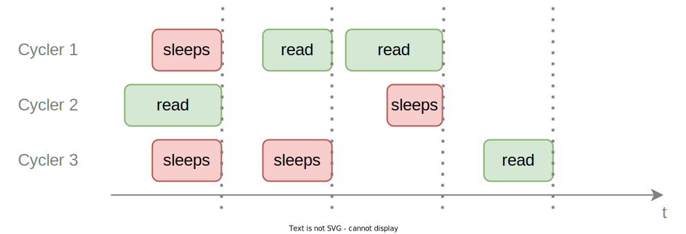

# Hardware Interface

TODO: Elaborate

- Hardware Interface
    - Trait
        - `produce_sensor_data()`
    - NAO
        - HardwareId retrieval (from HULA)
        - LoLA/HAL/HULA
            - Explain abbreviations
            - Overview: State/Connection/Network/Component Diagram, DataFlow Model
            - Socket Location and that it is a Unix Socket
            - Proxy
                - Message extraction and injection
                - Message format
                - LED animations
            - Aliveness
                - Network: Message format, UDP, multicast, JSON
                - Service states
            - `produce_sensor_data()`
        - Cameras
            - Video4Linux
            - Buffering, Zero-copy (-> Cycler)
            - Camera setup (registers)
        - Audio
            - ALSA
            - ALSA configuration
            - Later: Audio playback, Text-to-speech
    - Webots
        - HardwareId retrieval (robot name)
        - Webots bindings
        - `produce_sensor_data()`
        - Image, audio transfer to different threads
        - Simulation World
        - Directory structure, symlink

## Camera

This section explains the semantics of the camera interface in the context of multiple readers.
When a single thread reads a frame from the camera, it queries the next image from the device driver.
The thread sleeps until the image is ready and then continues its execution.
This means a single thread can never read the same image twice.

With multiple threads, the high level semantics stay the same, i.e. a thread never receives an image twice and if it reads an image it gets the next image provided by the camera.
The following plot shows this behavior in different situations.

The dotted vertical line shows whenever a new image is available by the camera.
Before the first image, `Cycler 2` is the first to read the image from the camera.
It queries the driver. All other cyclers that try to read an image before the image is provided by the camera, 
sleep and continue execution only when `Cycler 2` provides the image.
After that, `Cycler 1` is the first to read an image again. Because `Cycler 3` also reads an image, it sleeps until the image is provided by `Cycler 1`. Of course this also works if only a single cycler tries to read an image.
