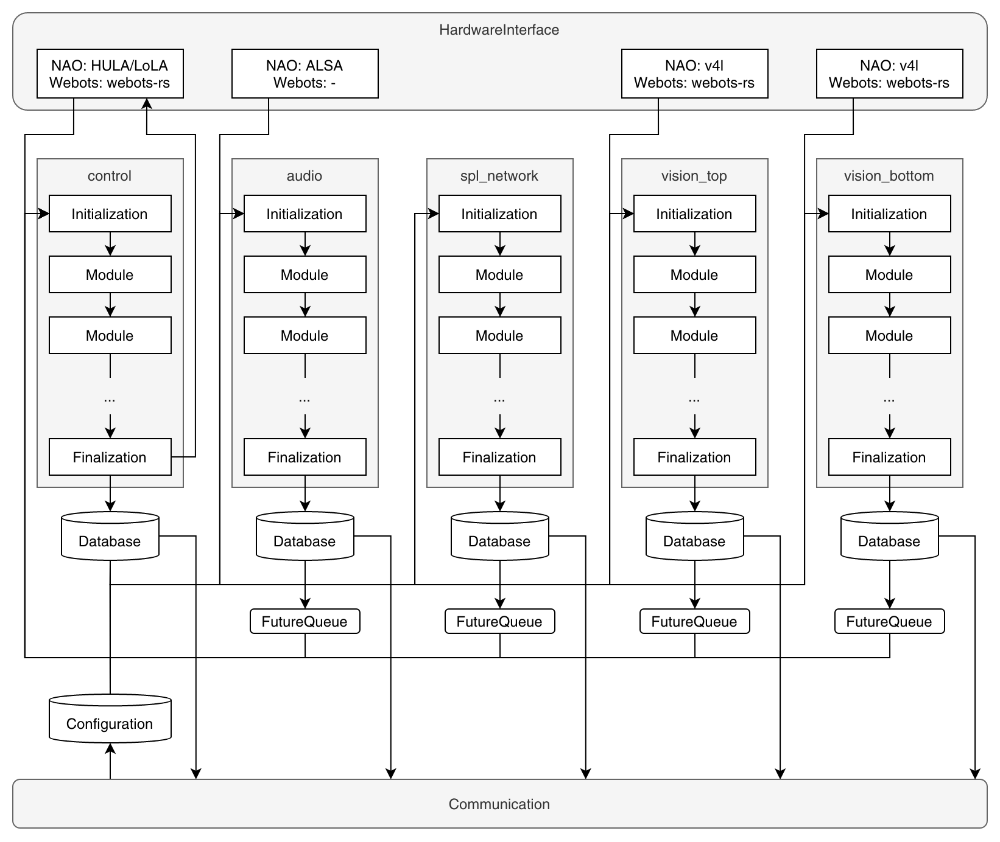

# Runtime

The runtime is the component in the robotic control software that encapsulates all subcomponents e.g. the hardware interface, cyclers, and communication.
Here is a more detailed overview extending the drawing from [Overview](./overview.md):

This section and following ones will cover this drawing in more detail. Many dataflow connections are still left out to improve readability.

The runtime is constructed with an already existing and initialized hardware interface.
The runtime contains all subcomponents and therefore is in charge to construct them.
Subcomponents require to be interconnected with each other.
The runtime therefore creates all necessary communication channels and buffers that are shared between the subcomponents.
More details on the connections between cyclers and communication are given in [Communication](./communication.md).

The communication subcomponent and each cycler are executed in separate threads which are started.
The next section [Cyclers](./cyclers.md) talks more about the cyclers.
