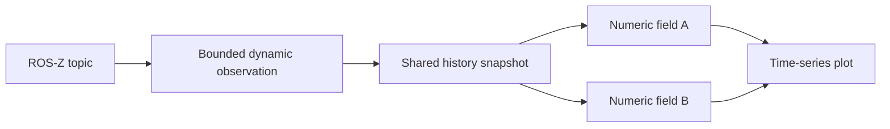

# Twix

Twix is the ROS-Z debugging UI.

Run it from the repository with:

```bash
./twix /42
```

The positional namespace is optional. If provided, it must be an absolute ROS-Z namespace such as `/42`; bare values such as `42` are invalid. If omitted, Twix uses the last stored namespace and then falls back to `/`.

To connect through a specific Zenoh router endpoint at startup, pass `--router`:

```bash
./twix /42 --router tcp/127.0.0.1:7447
```

If an old saved layout fails to load, or if you want to reset the current panel setup, start Twix with `--clear`.

Twix checks the local repository version at startup and warns when the running binary is older than the checked-out `tools/twix/Cargo.toml` version. Use `--repository-root <path>` to point that check at a different checkout.

ROS-Z Twix currently contains Text, Image, Map, Parameter, and Plot panels. The Text panel observes one ROS-Z topic through `ros-z-debug`, renders the latest dynamic payload as JSON, and shows sample metadata. The Image panel observes `TimeWrapper<ros2::sensor_msgs::image::Image>` topics, defaults to `inputs/left_image`, and renders the latest raw camera frame. The Parameter panel discovers ROS-Z nodes with remote parameter services, shows full snapshots or selected paths as JSON, and writes selected paths to active layers with revision checks.

The Text and Plot panels' **Topic** inputs accept both a topic and a nested field path. In Text, enter just the topic to display its whole message, or append a field path with a dot and press Enter:

- `detected_objects.inner` selects the wrapped detections.
- `detected_objects.inner[2].bounding_box.confidence` selects the third detected object's confidence. Arrays and sequences use zero-based indices, and paths can continue through nested structs and arrays.
- `status.state::Walking.speed` selects a field in an enum variant's payload. The selected value is unavailable while another variant is active.
- `topic."field.with.dots"` selects a field whose name contains punctuation. Field and variant names can be JSON-quoted.

Topics and fields autocomplete in the same input. Array completions include templates such as `detected_objects.inner[...]`. Selecting a template highlights `...` so you can replace it with an index, move past the closing bracket, and continue into the element's fields. Templates also work when the current array is empty. For a topic whose root is an array, use `topic[2]`.

Press **Ctrl+F** to focus and select the topic input in the active Text, Image, or live Plot panel. In Plot, this focuses the first line; adding a line focuses its own input. Press **Ctrl+Space** or **Arrow Down** in a completion input to open its dropdown, including when the input is empty. Arrow Down also highlights the first suggestion. Use the arrow keys to choose a completion and Enter to apply it. The input keeps focus with the cursor after the completion, so you can continue typing the path.

Present optionals are unwrapped when continuing through a path. Absent optionals and missing sequence elements appear as unavailable values; invalid paths show an error. Selecting an optional or enum itself displays its full value. Map entries are not traversable in this first version, but the whole map can be displayed.

Field completions use the schema from the latest received sample of the selected topic, including fields in absent optionals and inactive enum variants. Select a topic first to browse its fields, or enter a full path directly. Sequence index suggestions use the current length and show at most 64 indices; larger indices can be entered manually. Changing the field does not reconnect the topic subscription. Existing saved topic/field selections restore into the combined input. Displayed timestamps and publication metadata still refer to the original message. For topic names containing dots, the longest matching discovered topic takes precedence when separating topic and field path.

## Plot panel

Select **Plot** in the panel picker. Enter a numeric topic, or choose a topic and continue into its fields using the same completion input as Text. For example, `detected_objects.inner[2].bounding_box.confidence` plots the third detection's confidence. Integer and floating-point scalars are supported, including present optional numbers. Collections, strings, booleans, and enums need a numeric field selection; conversions and state backgrounds are deferred.

Use **Add line** to compare sources on the same axes. Each line has a color picker, visibility checkbox, and Remove button. The legend identifies each source, and hovering over a line shows coordinates. A lone sample is drawn as a point. Missing array elements, absent optionals, inactive enum variants, and NaN/infinite values break lines into separate segments. The source row shows the latest selection problem and the number of gaps in its retained history.

The live view follows a common newest publisher timestamp, displayed as zero seconds on the X axis. All lines use source timestamps, so comparisons across publishers assume a shared clock. This uses publication metadata, not a nested `TimeWrapper.time` field. The axis stops advancing when no new samples arrive. Numeric values use `f64` plot coordinates, so very large integers can lose precision.

**History** defaults to 30 seconds and accepts 1–600 seconds. Each topic retains at most 4096 samples, so high-rate topics may cover less than the requested duration. Changing history starts a new buffer. **Pause** freezes the displayed samples and time origin while live collection continues. While paused, drag to pan, scroll to zoom, or use the secondary mouse button to box-zoom. **Reset view** fits the snapshot; **Resume** returns to the current live window. Source and history controls are disabled while paused, but colors and visibility remain editable.

Layouts save source paths, colors, visibility, and history duration. Restoring a plot starts fresh observations in live mode. Changing the robot namespace also clears displayed history and resumes the plot.

The plot dataflow is:



`ros-z-debug` owns sample retention and observation recovery. Within a plot, `PlotHistory` owns one observation per distinct topic reference and shares decoded snapshots across its lines. Notifications request redraws and refresh the history snapshot, which can include multiple samples received between frames. Field changes reproject that history without reconnecting. `SeriesData` applies `ValuePath` directly to dynamic values, caches the numeric projection until the snapshot or path changes, and separates gaps before rendering. Pausing stops snapshot refresh, leaving the bounded live observations running. Removing the last line using a topic releases its observation.

ROS-Z Twix reads keybindings from `hulks/twix-ros-z.toml`. Legacy Twix keeps using `hulks/twix.toml`, so the two tools do not share incompatible keybinding schemas. The default ROS-Z keybindings are:

| Key | Action |
| --- | --- |
| `C-t` | `open_split` |
| `C-T` | `open_tab` |
| `C-o` | `focus_namespace` |
| `C-p` | `focus_panel` |
| `C-f` | `focus_topic` |
| `C-h`, `C-Left` | `focus_left` |
| `C-j`, `C-Down` | `focus_below` |
| `C-k`, `C-Up` | `focus_above` |
| `C-l`, `C-Right` | `focus_right` |
| `C-w` | `close_tab` |
| `C-d` | `duplicate_tab` |
| `C-S-Backspace` | `close_all` |

Supported action names are `open_split`, `open_tab`, `focus_namespace`, `focus_panel`, `focus_topic`, `focus_left`, `focus_below`, `focus_above`, `focus_right`, `close_tab`, `duplicate_tab`, `close_all`, and `no_op`. The `focus_topic` binding is configurable in `hulks/twix-ros-z.toml`, like the other actions.

Directional focus selects the nearest visible panel and outlines it. Press `Tab` after moving focus to enter that panel's controls; subsequent `Tab` and `Shift-Tab` presses follow the normal control order.
