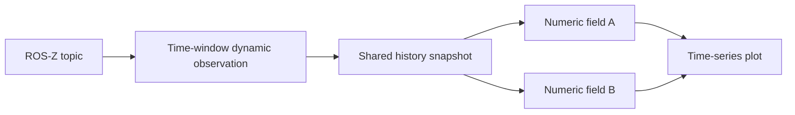

# Twix

Twix is the ROS-Z debugging UI.

Run it from the repository with:

```bash
./twix /42
```

The positional namespace is optional.
If provided, it must be an absolute ROS-Z namespace such as `/42`; bare values such as `42` are invalid.
If omitted, Twix uses the last stored namespace and then falls back to `/`.

To connect through a specific Zenoh router endpoint at startup, pass `--router`:

```bash
./twix /42 --router tcp/127.0.0.1:7447
```

To start with one blank workspace instead of restoring the saved session, run Twix with `--clear`.
User presets are retained.

Twix checks the local repository version at startup and warns when the running binary is older than the checked-out `tools/twix/Cargo.toml` version.
Use `--repository-root <path>` to point that check at a different checkout.

## Workspaces and presets

Workspaces are named groups in one shared docking layout.
Every tab bar uses the same controls and drag-and-drop behavior.
Drag a panel to the outer tab bar, drag an entire workspace into another tab group, or drop beside a group to split the layout.
Moving panels preserves their live state and unfinished edits.
Hover over a tab while dragging to reveal its contents.

Click **+** in any tab bar to search panel types, bundled layouts, and user presets.
The outer tab bar also offers **Blank workspace**.
Search is focused immediately; use the arrow keys and Enter to open a layout, or Escape to cancel without creating a tab.
Click a tab to switch, or right-click its title to rename it.
The close icon or middle-click closes a panel or an entire group immediately, discarding its current state.
Closing the final panel leaves a fresh Text panel.

The **+** picker contains bundled layouts (**Overview**, **Vision**, **Parameters**) and your saved layouts.
Opening a preset inserts a fresh copy into the chosen tab group, leaving existing panels intact.
Changes affect only that working copy.
Right-click any panel or group and choose **Save as preset…** to save that subtree; an existing name changes the action to **Overwrite**.
The name editor is focused immediately and stays open while editing.
The trash icon beside a user preset in the **+** picker deletes it after confirmation; open copies are unaffected.
The save dialog selects its name field immediately; type a name and press Enter to save, or Escape to cancel.

Presets include nested groups, names, splits, active tabs, focus, and panel settings.
Namespace, router, and theme remain global.
The whole docking layout is autosaved and restored on restart.
Named groups retain their identity when moved or reduced to one child.
Only saved panel settings are restored, not live samples or unfinished parameter value edits.
Sessions and presets use the same saved layout format.
An unreadable session opens a blank workspace and displays an error; the original data is preserved under `workspace_session_recovery` in eframe storage when the new session is saved.

User presets are JSON files in `dirs::config_dir()/hulks/twix-ros-z/presets/` (`$XDG_CONFIG_HOME/hulks/twix-ros-z/presets/` on Linux, defaulting to `~/.config/hulks/twix-ros-z/presets/`).
To contribute a bundled preset, save it through the UI, copy the file to `tools/twix/presets/`, and register it in `tools/twix/src/presets.rs`.
Bundled files are embedded in the binary.
Validation checks the tree structure before constructing any panels.
Run `cargo test -p twix --bin twix` for preset validation, session, and headless layout tests.
These cover bundled presets, file operations, picker dialogs, and layout rendering and round trips.

## Panels

Choose a panel from the **+** picker.

| Panel | Purpose |
| --- | --- |
| Text | Display a topic's latest payload or a selected field as JSON. |
| Image | Display the latest raw camera frame from a `TimeWrapper<ros2::sensor_msgs::image::Image>` topic, defaulting to `inputs/left_image`. |
| Map | Display field or ground views with selectable layers for robot pose, balls, obstacles, and paths. |
| Parameter | Discover nodes with remote parameter services, display snapshots or selected paths as JSON, and write selected paths to active layers with revision checks. |
| Audio | Display microphone spectra and a waterfall for the selected channel, defaulting to `audio_spectrums`. |
| [Plot](#plot-panel) | Compare numeric topics or fields over time, with enum and boolean states in the background and parameters as threshold lines. |

## Topic and field selection

The Text and Plot panels' **Topic** inputs accept both a topic and a nested field path.
In Text, enter just the topic to display its whole message, or append a field path with a dot and press Enter:

- `detected_objects.inner` selects the wrapped detections.
- `detected_objects.inner[2].bounding_box.confidence` selects the third detected object's confidence.
  Arrays and sequences use zero-based indices, and paths can continue through nested structs and arrays.
- `status.state::Walking.speed` selects a field in an enum variant's payload.
  The selected value is unavailable while another variant is active.
- `topic."field.with.dots"` selects a field whose name contains punctuation.
  Field and variant names can be JSON-quoted.

Topics and fields autocomplete in the same input.
Array completions include templates such as `detected_objects.inner[...]`.
Selecting a template highlights `...` so you can replace it with an index, move past the closing bracket, and continue into the element's fields.
Templates also work when the current array is empty.
For a topic whose root is an array, use `topic[2]`.

Press **Ctrl+F** to focus and select the topic input in the active Text, Image, or live Plot panel.
In Plot, this focuses the first line; adding a line focuses its own input.
Press **Ctrl+Space** or **Arrow Down** in a completion input to open its dropdown, including when the input is empty.
Arrow Down also highlights the first suggestion.
Use the arrow keys to choose a completion and Enter to apply it.
The input keeps focus with the cursor after the completion, so you can continue typing the path.

Present optionals are unwrapped when continuing through a path.
Absent optionals and missing sequence elements appear as unavailable values; invalid paths show an error.
In Text, selecting an optional or enum itself displays its full value.
Map entries are not traversable in this first version, but Text can display the whole map.

Field completions use the schema from the latest received sample of the selected topic, including fields in absent optionals and inactive enum variants.
Select a topic first to browse its fields, or enter a full path directly.
Sequence index suggestions use the current length and show at most 64 indices; larger indices can be entered manually.
Changing the field does not reconnect the topic subscription.
Existing saved topic/field selections restore into the combined input.
For topic names containing dots, the longest matching discovered topic takes precedence when separating topic and field path.

## Plot panel

Select **Plot** in the panel picker.
Enter a numeric topic, or choose a topic and continue into its fields using the same completion input as Text.
For example, `detected_objects.inner[2].bounding_box.confidence` plots the third detection's confidence.
Integer and floating-point scalars are supported, including present optional numbers.
Enums and booleans are shown as states in the background; collections and strings need a numeric, enum, or boolean field selection, or a [conversion](#conversions) that computes one.

Use **Add item** to compare sources on the same axes.
Each item has a color picker, visibility checkbox, and X button beside the topic field to remove it.
An icon at the start of each row shows the item type: a line chart for numeric topic lines, a timeline for topic states, and a threshold icon for parameter thresholds.
The item list identifies each source by its color, and hovering near a line shows its name, value, and time in a tooltip.
The grid and crosshair are drawn faintly so they guide reading without competing with the data.
Items are drawn as lines by default; the style button beside the info button toggles an item between line and scatter mode, which draws each sample as an unconnected point.
In line mode, a lone sample is drawn as a point.
Missing array elements, absent optionals, inactive enum variants, and NaN/infinite values break lines into separate segments.
Hover over or click the info button beside the topic field to see the observation status, sample count, gap count, and any selection problem.

### Conversions

Click an item's conversion button (Σ) to compute the displayed value with a [Rhai](https://rhai.rs/book/) script, for example to compare an angle in degrees with other signals.
The selected field is available as `value`, with the same structure the Text panel shows: structs are maps, sequences are arrays, absent optionals are `()`, and enums are maps with `variant_index`, `variant_name`, and `payload`.
All numbers are floats, so `value / 2` does not round.
A script can be a single expression, such as `value.to_degrees()` or `hypot(value.x, value.y)`, or several statements whose last expression is the result:

```rhai
let speed = hypot(value.x, value.y);
if speed > 0.1 { speed } else { () }
```

The result decides how a sample is drawn:

| Result | Display |
| --- | --- |
| Number | Point of the item's line |
| Boolean or string | State in the background, for example `value > 0.5` or `if value > 1.0 { "fast" } else { "slow" }` |
| `()` | Skipped sample that breaks the line without counting as a gap |

So a script can turn a struct or array into a number, turn an enum into a number with `value.variant_index`, or turn numbers into states.
**Examples** inserts common scripts such as unit conversions, absolute value, vector and array length, and a fallback for absent optionals; **Clear** restores the received values.
The editor previews the latest selected value and its result.
While the script does not compile, the editor shows the error, and the last valid script stays applied and is saved with the layout.
Runtime errors, such as a missing field, and NaN or infinite results break the line and count as gaps; the info button shows the latest error.

The button is highlighted while a conversion is active, and hover tooltips append short scripts to the item's name, for example `inputs/imu_state.roll_pitch_yaw[0] (value.to_degrees())`.
Conversions apply to the item's entire displayed history without changing the received samples, so they can be edited while paused.
Changing a script converts the history within a few milliseconds per frame, so long histories fill in over several frames instead of freezing the UI.
Scripts from layouts cannot access files, the network, or other modules, and each sample's conversion is limited to 50,000 operations.

### States

Select an enum or boolean field, for example `primary_state`, to show its states as labeled, colored intervals behind the numeric lines.
This helps correlate state changes, such as transitions between motion states, with numeric data.
Each state item gets its own horizontal lane, so several enums can be compared at once; hiding an item through its checkbox gives its lane to the others.
Faint interval colors identify the variants and stay the same for a given enum, keeping the lines in the foreground.
Because variants have their own colors, the color picker is disabled for state items; the chosen color is kept for switching back to a numeric field.
Labels that do not fit an interval are shortened; hover over an interval away from the lines to see the item, state, and its time range.
States narrower than a pixel merge into one neutral band, so fast-changing values stay cheap to draw; zoom in while paused to tell them apart.
A state lasts until a sample with another variant arrives, and the current state extends to the newest displayed time.
Unavailable values, such as absent optionals or inactive parent variants, end the current state and count as gaps.
States follow the same time axis, history window, and pause/zoom behavior as the lines, and do not affect the Y axis range.

### Thresholds

Use **Add threshold** to draw a parameter as a dashed horizontal line, for example while tuning a threshold that guards an output.
Enter the parameter **Node**, relative to the robot namespace or absolute, and a dot-separated **Path**, for example node `obstacle_filter` and path `robot_confidence_threshold`.
Like topics, both inputs apply when you press Enter or choose a completion.
Nodes complete from discovered parameter services, and paths complete from the node's parameter snapshot.
A number draws one line, and an array of numbers, such as `[0.05, 0.1]`, draws one line per element.
Thresholds follow the node's parameter events, so a line moves when the parameter changes, including writes from the Parameter panel.
Thresholds have the same color, visibility, conversion, info, and remove controls as topic items; apply the same conversion as the compared signal to keep units consistent.
Threshold conversions receive each number as `value` and must return a number.
They are drawn without topic data and are included in the Y axis range.
If the node is unavailable, the info button shows the error, the last known value stays visible, and Twix keeps retrying.

### Time and history

The live view follows a common newest publisher timestamp, displayed as zero seconds on the X axis.
All lines use source timestamps, so comparisons across publishers assume a shared clock.
This uses publication metadata, not a nested `TimeWrapper.time` field.
The axis stops advancing when no new samples arrive.
Numeric values use `f64` plot coordinates, so very large integers can lose precision.

**History** defaults to 30 seconds and accepts 1–600 seconds.
Each topic retains all samples in the selected source-time window, without a sample-count cap.
Memory usage grows with topic rate, payload size, and history duration; stalled source timestamps prevent time-based eviction.
Changing history starts a new buffer.
**Pause** freezes the displayed samples and time origin while live collection continues.
Click the plot to focus it, then press **Space** to toggle pause/resume.
Space does not toggle the plot while editing a text field.
Zooming and panning are available while paused: drag or scroll with two fingers to pan, pinch or hold **Ctrl** (**Cmd** on macOS) while scrolling to zoom under the pointer, or drag with the secondary mouse button to box-zoom.
**Reset view** or a double-click/double-tap restores the exact configured history interval and fits the Y axis; **Resume** returns to the current live window.
Source and history controls are disabled while paused, but colors, visibility, drawing styles, and conversions remain editable.
Pausing also freezes threshold values until the plot resumes.

Layouts save source paths, threshold nodes and paths, colors, visibility, drawing styles, conversions, and history duration.
Invalid saved fields, for example from a hand-edited layout, fall back to their defaults without discarding the rest of the plot.
Restoring a plot starts fresh observations in live mode.
Changing the robot namespace also clears displayed history and resumes the plot.

### Dataflow


```mermaid
flowchart LR
    Topic[ROS-Z topic] --> Cache[Time-window dynamic observation]
    Cache --> Snapshot[Shared history snapshot]
    Snapshot --> FieldA[Numeric field A]
    Snapshot --> FieldB[Numeric field B]
    FieldA --> Plot[Time-series plot]
    FieldB --> Plot
```

`ros-z-debug` owns sample retention and observation recovery.
Within a plot, `PlotHistory` owns one observation per distinct topic reference and shares decoded snapshots across its lines.
Notifications request redraws and refresh the history snapshot, which can include multiple samples received between frames.
Field changes reproject that history without reconnecting.
`SeriesData` applies `ValuePath` directly to dynamic values, runs the conversion script, and caches each sample's result until the path or script changes.
New snapshots reuse the results of samples that are still retained, so only new samples are converted.
Numbers become line segments, and enum, boolean, and converted string samples merge into state intervals, with gaps separated before rendering.
Pausing stops snapshot refresh, leaving the live observations running.
Removing the last line using a topic releases its observation.
Each threshold subscribes to its node's parameter events and fetches a new snapshot when an event announces a newer revision.
It also refetches the full snapshot every two seconds, because a restarted node starts again at revision zero without sending events.
Each threshold follows its node separately, so several thresholds on one node multiply these requests.
Path changes reuse that snapshot, and changing the node or namespace restarts the subscription.

## Keybindings

ROS-Z Twix reads keybindings from `hulks/twix-ros-z.toml`.
Legacy Twix keeps using `hulks/twix.toml`, so the two tools do not share incompatible keybinding schemas.
The default ROS-Z keybindings are:

| Key | Action |
| --- | --- |
| `C-t` | `open_split` |
| `C-T` | `open_tab` |
| `C-o` | `focus_namespace` |
| `C-p` | `focus_panel` |
| `C-f` | `focus_topic` |
| `C-h`, `C-Left` | `focus_left` |
| `C-j`, `C-Down` | `focus_below` |
| `C-k`, `C-Up` | `focus_above` |
| `C-l`, `C-Right` | `focus_right` |
| `C-w` | `close_tab` |
| `C-d` | `duplicate_tab` |
| `C-S-Backspace` | `close_all` |

Supported action names are `open_split`, `open_tab`, `focus_namespace`, `focus_panel`, `focus_topic`, `focus_left`, `focus_below`, `focus_above`, `focus_right`, `close_tab`, `duplicate_tab`, `close_all`, and `no_op`.
The `focus_topic` binding is configurable in `hulks/twix-ros-z.toml`, like the other actions.

Directional focus selects the nearest visible panel and outlines it.
Press `Tab` after moving focus to enter that panel's controls; subsequent `Tab` and `Shift-Tab` presses follow the normal control order.
